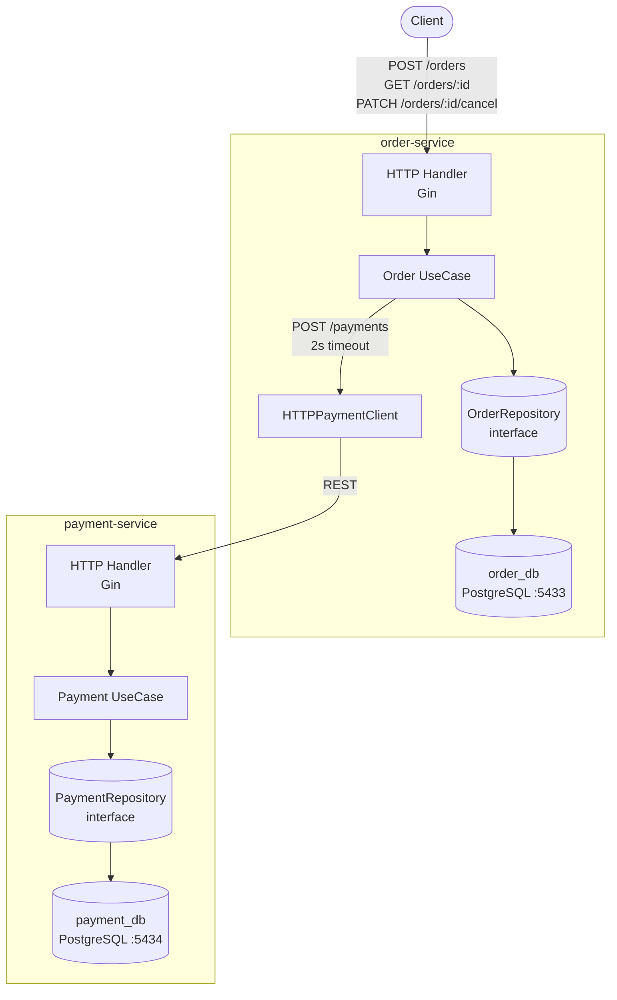

# Order & Payment Platform

A two-service microservice platform built with Go, Gin, and PostgreSQL, following Clean Architecture and Domain-Driven Design principles.

---

## Architecture Decisions

### Clean Architecture (per service)

Each service is structured in strict layers with a single direction of dependency:

```
Transport (HTTP) → Use Case → Domain
                      ↑
                 Repository (interface)
                      ↑
               Postgres (implementation)
```

- **Domain**: Pure Go structs, zero framework dependencies.
- **Repository (port)**: Interface defined in the `repository` package. Use cases depend only on the interface.
- **Use Case**: All business logic lives here. Depends on repository interfaces and external client interfaces — never on concrete implementations.
- **Transport**: Thin Gin handlers. Only parse requests, call use cases, return responses.
- **Composition Root** (`main.go`): The only place where concrete types are instantiated and wired together (manual DI).

### Money Representation

All monetary amounts are stored and transmitted as `int64` (cents). `float64` is **never** used for money to avoid floating-point precision errors.

### No Shared Code

Each service has its own domain models, interfaces, and utilities. There is no shared/common package. This enforces bounded-context isolation and allows services to evolve independently.

---

## Bounded Contexts

| Context | Responsibility | DB |
|---|---|---|
| **Order** | Lifecycle of a customer purchase: creation, payment orchestration, cancellation | `order_db` (port 5433) |
| **Payment** | Authorization of a payment transaction for a given order | `payment_db` (port 5434) |

The Order service **orchestrates** the flow: it creates the order, calls the Payment service synchronously via REST, and updates the order status based on the result. The Payment service is stateless with respect to orders — it only decides Authorized/Declined.

---

## Inter-Service Communication

- **Protocol**: REST over HTTP (synchronous)
- **Order → Payment**: `POST /payments` with `{"order_id": "...", "amount": 15000}`
- **HTTP Client Timeout**: 2 seconds (configured in `order-service/internal/app/app.go`)
- **Failure Handling**: If the Payment service is unreachable or times out, the Order service marks the order as `"Failed"` and returns `503 Service Unavailable` to the caller.

---

## Failure Handling

| Failure Scenario | Behavior |
|---|---|
| Payment service down | Order marked `Failed`, HTTP 503 returned |
| Payment service returns Declined | Order marked `Failed`, HTTP 201 returned with status |
| Order not found | HTTP 404 |
| Cancel a Paid order | HTTP 409 Conflict |
| Amount ≤ 0 | HTTP 400 Bad Request |
| Amount > 100000 cents | Payment `Declined`, Order `Failed` |
| Duplicate request (idempotency key) | Same order returned, no duplicate created |

---

## Architecture Diagram



---

## Getting Started

### Prerequisites
- Docker & Docker Compose

### Run everything

```bash
docker compose up --build
```

Services will be available at:
- Order Service: `http://localhost:8080`
- Payment Service: `http://localhost:8081`

---

## API Reference

### Order Service (`localhost:8080`)

#### Create Order

```bash
curl -X POST http://localhost:8080/orders \
  -H "Content-Type: application/json" \
  -H "Idempotency-Key: unique-request-id-1" \
  -d '{"customer_id": "cust-123", "item_name": "Laptop", "amount": 15000}'
```

**Response (201):**
```json
{
  "id": "550e8400-e29b-41d4-a716-446655440000",
  "customer_id": "cust-123",
  "item_name": "Laptop",
  "amount": 15000,
  "status": "Paid",
  "created_at": "2026-03-28T12:00:00Z"
}
```

#### Get Order

```bash
curl http://localhost:8080/orders/550e8400-e29b-41d4-a716-446655440000
```

#### Cancel Order

```bash
curl -X PATCH http://localhost:8080/orders/550e8400-e29b-41d4-a716-446655440000/cancel
```

**Error (409) — paid order:**
```json
{"error": "paid orders cannot be cancelled"}
```

#### Test Payment Decline (amount > 100000)

```bash
curl -X POST http://localhost:8080/orders \
  -H "Content-Type: application/json" \
  -d '{"customer_id": "cust-456", "item_name": "Yacht", "amount": 999999}'
```

**Response (201):**
```json
{
  "id": "...",
  "status": "Failed",
  ...
}
```

---

### Payment Service (`localhost:8081`)

#### Process Payment

```bash
curl -X POST http://localhost:8081/payments \
  -H "Content-Type: application/json" \
  -d '{"order_id": "550e8400-e29b-41d4-a716-446655440000", "amount": 15000}'
```

**Response (201 — Authorized):**
```json
{
  "id": "...",
  "order_id": "550e8400-e29b-41d4-a716-446655440000",
  "transaction_id": "a1b2c3d4-...",
  "amount": 15000,
  "status": "Authorized"
}
```

#### Get Payment by Order ID

```bash
curl http://localhost:8081/payments/550e8400-e29b-41d4-a716-446655440000
```

---

## Idempotency

`POST /orders` supports the `Idempotency-Key` header. If a request is retried with the same key, the original order is returned without creating a duplicate.

```bash
# First call — creates order
curl -X POST http://localhost:8080/orders \
  -H "Idempotency-Key: req-abc-123" \
  -H "Content-Type: application/json" \
  -d '{"customer_id": "cust-1", "item_name": "Book", "amount": 2500}'

# Retry — returns the same order, no duplicate
curl -X POST http://localhost:8080/orders \
  -H "Idempotency-Key: req-abc-123" \
  -H "Content-Type: application/json" \
  -d '{"customer_id": "cust-1", "item_name": "Book", "amount": 2500}'
```

---

## Order Status Flow

```
Pending → Paid       (payment authorized)
Pending → Failed     (payment declined or payment service unavailable)
Pending → Cancelled  (explicit cancel)
Paid    → ✗          (cannot cancel)
```
