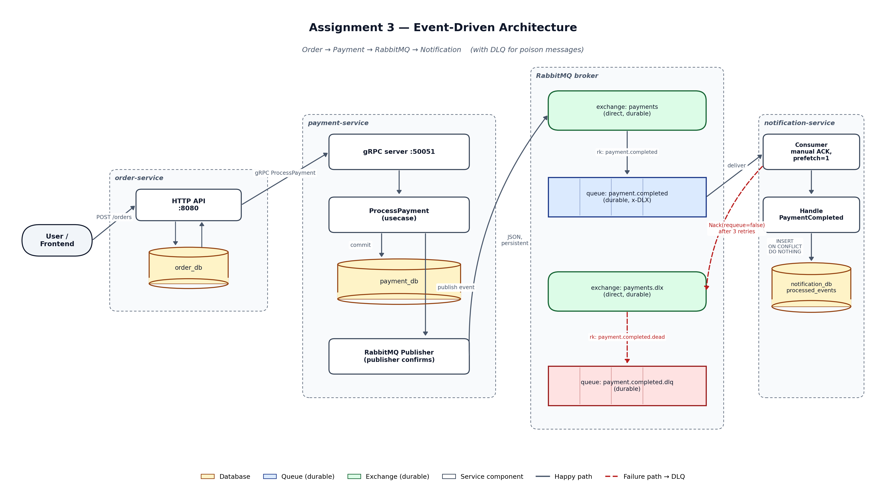

# Microservices Project — Advanced Programming 2

**Author:** Altynay Yertay (SE-2416)
**Course:** Advanced Programming 2, AITU

---

## Overview

A three-service Go system demonstrating the incremental adoption of microservice patterns across four assignments:

| Assignment | Theme | What was added |
|---|---|---|
| A1 | REST + Postgres | Order + Payment services with HTTP APIs, Clean Architecture |
| A2 | Synchronous gRPC | Order ↔ Payment over gRPC, contract-first protos, streaming server |
| A3 | Event-Driven (RabbitMQ) | Notification Service consumer, durable queues, manual ACKs, Postgres idempotency, DLQ |
| **A4** | **Caching, Resilience, Email Adapter** | **Redis cache-aside, background retry with exponential backoff, EmailSender adapter, two-tier idempotency, rate limiter (bonus)** |

---

## Architecture



The system runs as 9 containers:

| Container | Role |
|---|---|
| `order-service` | HTTP REST API + gRPC status server + Redis cache + rate limiter |
| `payment-service` | gRPC server + HTTP API + RabbitMQ publisher with publisher confirms |
| `notification-service` | RabbitMQ consumer + Redis idempotency cache + EmailSender |
| `order-db` | Postgres 16 — orders, idempotency keys |
| `payment-db` | Postgres 16 — payment transactions |
| `notification-db` | Postgres 16 — processed_events |
| `rabbitmq` | RabbitMQ 3.13 with management plugin — events + DLQ |
| `redis` | Redis 7 — order cache + notification idempotency + rate limit counters |
| `frontend` | nginx serving the static SPA dashboard |

---

## Tech stack

- **Language:** Go 1.23
- **HTTP:** Gin
- **RPC:** gRPC (google.golang.org/grpc)
- **Databases:** Postgres 16 (lib/pq)
- **Messaging:** RabbitMQ 3.13 (rabbitmq/amqp091-go)
- **Cache:** Redis 7 (redis/go-redis v9.7.0)
- **Email:** Mailtrap SMTP sandbox / Simulated provider
- **Config:** godotenv

---

## Quick start

```bash
cp .env.example .env
# Optional: fill in SMTP_USERNAME and SMTP_PASSWORD if you want real email
# (PROVIDER_MODE=SMTP). Leave defaults for simulated mode.
docker compose up --build
```

Wait for `[notification] consumer started, waiting for messages...` before sending requests.

| Service | URL |
|---|---|
| Frontend Dashboard | http://localhost:13000 |
| Order Service API | http://localhost:18080 |
| Payment Service API | http://localhost:18081 |
| RabbitMQ Management UI | http://localhost:15672 (guest / guest) |
| Redis | localhost:6379 |

---

## Assignment 4 details

### Caching strategy — Cache-Aside in order-service

The order-service uses a **cache-aside** (lazy-load) pattern with Redis:

- **Read path:** `GetOrder` checks Redis first. On a cache miss, the order is fetched from Postgres and written to Redis with a configurable TTL (default 5 minutes, `ORDER_CACHE_TTL_SECONDS`). Subsequent reads are served from memory in sub-millisecond time.
- **Write path:** Any operation that mutates an order — `CancelOrder` or a failed-payment outcome — **deletes** the Redis key rather than updating it. Delete-on-write avoids the risk of writing stale data back into the cache and is always safe to retry.
- **Failure handling:** Redis errors are logged and the request falls through to Postgres. The cache is never in the critical path for correctness.

Redis key layout:

```
order:<order_id>  →  JSON-encoded domain.Order  (TTL 5 m)
```

---

### Background worker with retry + exponential backoff

The notification-service `sendWithRetry` helper retries failed email sends before giving up:

- Up to `EMAIL_MAX_RETRIES` attempts (default 3).
- Delay between attempts: `BaseDelay × 2^(attempt-1)`.
  For `EMAIL_BACKOFF_BASE_MS=2000`: **2 s → 4 s → 8 s**.
- Each `time.After` sleep selects on `ctx.Done()` so graceful shutdown is honoured mid-backoff.
- When all retries are exhausted the error propagates to the RabbitMQ consumer, which Nacks the message. A3's DLQ catches it after the in-process retry budget is also spent.

---

### EmailSender adapter pattern

The use case depends only on the `EmailSender` interface (`internal/email/sender.go`). Two concrete implementations are provided:

| Provider | Behaviour |
|---|---|
| `SimulatedSender` | Adds configurable latency and probabilistic failures — makes the retry logic observable without external services |
| `SMTPSender` | Sends real email via SMTP — tested with the Mailtrap sandbox |

Selection is controlled by `PROVIDER_MODE` (`SIMULATED` or `SMTP`). `email.Build()` in `factory.go` reads the env var and constructs the right implementation; the use case never imports a concrete provider package.

---

### Two-tier idempotency

Duplicate `payment.completed` events are rejected at two layers:

1. **Redis (fast):** `SETNX ie:<event_id> 1 EX 86400` — atomic, sub-millisecond. If the key already exists, the event is a duplicate and is Ack'd immediately.
2. **Postgres (durable):** `INSERT INTO processed_events (event_id) … ON CONFLICT DO NOTHING` — survives a Redis restart or eviction. Always consulted if Redis is unavailable.

Redis key layout:

```
ie:<event_id>      →  "1"  (claim marker, TTL 24 h)
sent:<payment_id>  →  "1"  (delivery marker, TTL 24 h)
```

If Redis is unhealthy the service logs a warning and degrades gracefully to Postgres-only idempotency — correctness is preserved, only the speed of duplicate detection degrades.

---

### Bonus: API Rate Limiter

A **fixed-window** rate limiter is wired as Gin middleware in order-service:

- **Algorithm:** `INCR rate:<client_ip>` (atomic). If the count reaches 1, `EXPIRE` is set for the window duration.
- **Default:** 10 requests per minute per IP (`RATE_LIMIT_PER_MIN`).
- **Over-limit:** HTTP 429 with `Retry-After` header and JSON body `{error, limit, window_sec, retry_after}`.
- **Headers on every response:** `X-RateLimit-Limit`, `X-RateLimit-Remaining`.
- **Failure mode:** If Redis is unreachable, the request is allowed through (logged). The rate limiter is advisory, not a security gate.

Redis key layout:

```
rate:<client_ip>  →  request counter  (TTL 60 s)
```

---

## Environment variables

| Variable | Default | Meaning |
|---|---|---|
| `REDIS_ADDR` | `redis:6379` | Redis host:port |
| `REDIS_PASSWORD` | _(empty)_ | Redis AUTH password |
| `REDIS_DB` | `0` | Redis database index |
| `ORDER_CACHE_TTL_SECONDS` | `300` | Order cache TTL in seconds (5 min) |
| `RATE_LIMIT_PER_MIN` | `10` | Max requests per IP per minute for the rate limiter |
| `NOTIFICATION_IDEMPOTENCY_TTL_SECONDS` | `86400` | TTL for Redis idempotency keys (24 h) |
| `EMAIL_MAX_RETRIES` | `3` | Maximum email send attempts (including first try) |
| `EMAIL_BACKOFF_BASE_MS` | `2000` | Base delay in ms for exponential backoff |
| `PROVIDER_MODE` | `SIMULATED` | Email provider: `SIMULATED` or `SMTP` |
| `SIMULATOR_LATENCY_MS` | `200` | Artificial send latency for the simulated provider |
| `SIMULATOR_FAILURE_RATE` | `0.3` | Probability (0–1) of simulated send failure |
| `SMTP_HOST` | `sandbox.smtp.mailtrap.io` | SMTP server hostname |
| `SMTP_PORT` | `2525` | SMTP server port |
| `SMTP_USERNAME` | _(empty)_ | SMTP username (required when `PROVIDER_MODE=SMTP`) |
| `SMTP_PASSWORD` | _(empty)_ | SMTP password (required when `PROVIDER_MODE=SMTP`) |
| `SMTP_FROM` | `no-reply@microservice.local` | Sender address in outgoing email |

---

## How to test — manual verification

### Test 1 — Cache hit / miss

```bash
# Create an order
curl -X POST http://localhost:18080/orders \
  -H "Content-Type: application/json" \
  -d '{"customer_id":"c1","customer_email":"a@b.com","item_name":"Laptop","amount":9999}'

# Copy the order id from the response, then:
ID=<id-from-response>

# Confirm no cache key yet
docker exec redis redis-cli KEYS "order:$ID"
# (empty)

# Fetch the order — this populates the cache
curl http://localhost:18080/orders/$ID

# Confirm the key now exists
docker exec redis redis-cli KEYS "order:$ID"
# order:<id>

# Check TTL (should be ~299)
docker exec redis redis-cli TTL "order:$ID"
```

Fetch the order a second time; order-service logs will show a cache hit instead of a DB query.

---

### Test 2 — Retry with exponential backoff

For a clearer demo, set `SIMULATOR_FAILURE_RATE=0.8` in `.env` and restart:

```bash
docker compose up -d --build notification-service
```

Send a few orders and watch notification-service logs:

```
[email][simulated] FAIL order=<id>
[notification][retry] order=<id> attempt 1/3 failed: ... sleeping 2s
[email][simulated] FAIL order=<id>
[notification][retry] order=<id> attempt 2/3 failed: ... sleeping 4s
[email][simulated] OK   order=<id>
[notification][retry] order=<id> succeeded on attempt 3/3
```

---

### Test 3 — Rate limiter (bonus)

```bash
for i in {1..12}; do
  curl -s -o /dev/null -w "Request #$i: HTTP %{http_code}\n" \
    -X POST http://localhost:18080/orders \
    -H "Content-Type: application/json" \
    -d '{"customer_id":"spam","customer_email":"s@s.com","item_name":"X","amount":100}'
done
```

Expected: requests 1–10 return `201 Created`, requests 11–12 return `429 Too Many Requests` with a `Retry-After` header.

---

### Test 4 — DLQ (Assignment 3, still works)

```bash
curl -X POST http://localhost:18080/orders \
  -H "Content-Type: application/json" \
  -d '{"customer_id":"x","customer_email":"fail@test.com","item_name":"DLQTest","amount":500}'
```

After ~6 seconds the message appears in `payment.completed.dlq` in the RabbitMQ Management UI (http://localhost:15672 → Queues → `payment.completed.dlq`).

---

### Test 5 — Switching to real SMTP (Mailtrap)

1. Get free credentials at https://mailtrap.io/sandboxes.
2. In `.env` set: `PROVIDER_MODE=SMTP`, `SMTP_USERNAME=<yours>`, `SMTP_PASSWORD=<yours>`.
3. Restart: `docker compose up -d --build notification-service`.
4. Send a happy-path order — check your Mailtrap inbox for the confirmation email.

---

## Project structure

```
microservice/
├── order-service/          # HTTP + gRPC + Postgres + Redis cache + rate limiter
│   ├── cmd/order-service/
│   └── internal/
│       ├── cache/          # OrderCache interface
│       ├── domain/
│       ├── infrastructure/redis/   # Cache-aside implementation
│       ├── repository/postgres/
│       ├── transport/http/         # Gin handlers + rate limiter middleware
│       └── usecase/
├── payment-service/        # gRPC server + HTTP API + RabbitMQ publisher
├── notification-service/   # RabbitMQ consumer + Redis idempotency + EmailSender
│   ├── cmd/notification-service/
│   └── internal/
│       ├── cache/          # IdempotencyCache interface
│       ├── domain/
│       ├── email/          # EmailSender interface + Simulated + SMTP + factory
│       ├── infrastructure/
│       │   ├── rabbitmq/   # Consumer + topology
│       │   └── redis/      # Idempotency cache implementation
│       ├── repository/postgres/
│       └── usecase/
├── frontend/               # Static SPA served by nginx
├── docker-compose.yml
├── .env.example
├── CHANGELOG-A4.md
└── README.md
```

---

## Defense evidences

Screenshots and recordings for each assignment are in the `evidences/` folder.

---

## API reference

### Order Service — `http://localhost:18080`

**Create order**

```bash
curl -X POST http://localhost:18080/orders \
  -H "Content-Type: application/json" \
  -H "Idempotency-Key: req-001" \
  -d '{
    "customer_id":    "cust-1",
    "customer_email": "alice@example.com",
    "item_name":      "MacBook",
    "amount":         150000
  }'
```

**Get order** (served from Redis cache after first fetch)

```bash
curl http://localhost:18080/orders/<id>
```

**Cancel order** (also invalidates the Redis cache key)

```bash
curl -X PATCH http://localhost:18080/orders/<id>/cancel
```

### Order status flow

```
Pending → Paid       (payment authorized)
Pending → Failed     (payment declined or service unavailable)
Pending → Cancelled  (explicit cancel request)
Paid    → ✗          (cannot cancel — 409 Conflict)
```

### Payment Service — `http://localhost:18081`

```bash
curl -X POST http://localhost:18081/payments \
  -H "Content-Type: application/json" \
  -d '{"order_id":"<id>","amount":9999,"customer_email":"alice@example.com"}'

curl http://localhost:18081/payments/<order-id>
```
