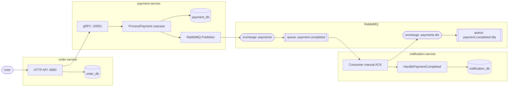

# Order, Payment & Notification Platform

A Go microservice platform built across three Advanced Programming 2 assignments. Each assignment adds one architectural pattern on top of the previous one:

| Assignment | Theme | What was added |
|---|---|---|
| 1 | REST + Postgres | Two services with HTTP APIs, Clean Architecture |
| 2 | Synchronous gRPC | Order ↔ Payment over gRPC, contract-first protos, streaming server |
| **3** | **Event-Driven (RabbitMQ)** | **Notification Service consumer, durable queues, manual ACKs, idempotency, DLQ** |

The frontend dashboard from Assignment 2 still works at <http://localhost:13000>.

---

# Assignment 3 — Event-Driven Notifications

> Author: Altynay Yertay · AITU Spring 2026

After a successful payment is committed to the database, **Payment Service** publishes a `payment.completed` event to a durable RabbitMQ exchange. **Notification Service** consumes the event with manual acknowledgements, deduplicates it via a Postgres-backed `processed_events` table, and "sends an email" (logs to stdout). Permanent failures land in a Dead Letter Queue after a bounded retry budget.

## Architecture (event flow)


```mermaid
flowchart LR
    User([User])

    subgraph Order["order-service"]
        OrderAPI["HTTP API :8080"]
        OrderDB[("order_db")]
    end

    subgraph Payment["payment-service"]
        PayGRPC["gRPC :50051"]
        PayUC["ProcessPayment usecase"]
        PayDB[("payment_db")]
        PayPub["RabbitMQ Publisher"]
    end

    subgraph RMQ["RabbitMQ"]
        ExMain(["exchange: payments"])
        QMain[["queue: payment.completed"]]
        ExDLX(["exchange: payments.dlx"])
        QDLQ[["queue: payment.completed.dlq"]]
    end

    subgraph Notify["notification-service"]
        NConsumer["Consumer manual ACK"]
        NUC["HandlePaymentCompleted"]
        NDB[("notification_db")]
    end

    User --> OrderAPI
    OrderAPI --> OrderDB
    OrderAPI --> PayGRPC
    PayGRPC --> PayUC
    PayUC --> PayDB
    PayUC --> PayPub
    PayPub --> ExMain
    ExMain --> QMain
    QMain --> NConsumer
    NConsumer --> NUC
    NUC --> NDB
    NConsumer --> ExDLX
    ExDLX --> QDLQ
```

## Reliability — how each requirement is met

### Manual acknowledgements
`notification-service/internal/infrastructure/rabbitmq/consumer.go` calls `Consume` with `autoAck = false`. Every delivery ends with exactly one of `Ack`, `Nack(requeue=true)` or `Nack(requeue=false)`. The acknowledgement is sent **only after** the handler reports success — meaning the idempotency row was committed and the email was logged. If the consumer crashes mid-message, RabbitMQ redelivers the unacked message.

### Durability
- Both exchanges (`payments`, `payments.dlx`) are declared `durable: true`.
- Both queues (`payment.completed`, `payment.completed.dlq`) are declared `durable: true`.
- Every `Publishing` is sent with `DeliveryMode: amqp.Persistent` (=2).
- The broker's data directory is on a named Docker volume (`rabbitmq_data`).

The combination of durable queues + persistent messages + named volume means a `docker restart rabbitmq` does not lose any in-flight events.

### Publisher reliability
`payment-service/internal/infrastructure/rabbitmq/publisher.go` enables **publisher confirms** (`ch.Confirm(false)`) and uses `PublishWithDeferredConfirmWithContext`. The publish call blocks until the broker explicitly confirms the message, giving us at-least-once delivery on the producer side.

### Idempotent consumer
The consumer must tolerate duplicate deliveries. Each `event_id` is treated as a one-shot key:

```sql
INSERT INTO processed_events (event_id) VALUES ($1)
ON CONFLICT (event_id) DO NOTHING
```

`MarkProcessed` returns `(inserted bool, err error)`. If `inserted == false`, it's a duplicate — the handler logs and returns `nil`, the message is `Ack`'d, no email is "sent" again. The check is **atomic at the database level**, so even concurrent consumers can't double-process. This is more robust than an in-memory map, which would forget every event on restart.

### Graceful shutdown
Both Go services use `signal.NotifyContext(ctx, SIGINT, SIGTERM)`:
- `payment-service` stops accepting new HTTP/gRPC requests, drains in-flight ones with a 10s timeout, then closes the publisher channel and AMQP connection.
- `notification-service` cancels the consume context, the delivery channel returns, the consumer loop exits, the channel and connection are closed cleanly.

No message is left unacked because of an abrupt close, no DB connection is leaked.

### Separation of Concerns
The use case in each service depends only on **interfaces** — repositories and `EventPublisher`. The RabbitMQ adapter lives in `internal/infrastructure/rabbitmq/`, which is the only package that imports `amqp091-go`. Messaging logic is testable and swappable without touching business code.

## Dead Letter Queue (bonus +10%)

**Topology** — `payment.completed` is declared with arguments:

```
x-dead-letter-exchange:    payments.dlx
x-dead-letter-routing-key: payment.completed.dead
```

`payments.dlx` is bound to `payment.completed.dlq`.

**Retry logic** in `consumer.go`:

| Situation | Action |
|---|---|
| `attempts < 3` (transient error) | `Nack(requeue=true)` → back to main queue |
| `attempts ≥ 3` | `Nack(requeue=false)` → DLX → DLQ |
| `ErrPermanent` from handler | `Nack(requeue=false)` → DLQ immediately |
| Malformed JSON | `Nack(requeue=false)` → DLQ immediately |

Attempts are tracked in-process by `MessageId` under a mutex. We don't rely on the AMQP `x-death` header for counting because RabbitMQ only stamps it on dead-letter, not on plain `Nack(requeue=true)`.

### DLQ demo

Send any order with `customer_email = "fail@test.com"`. The handler returns a transient error every time:

```bash
curl -X POST http://localhost:18080/orders \
  -H "Content-Type: application/json" \
  -d '{"customer_id":"x","customer_email":"fail@test.com","item_name":"BadOrder","amount":4999}'
```

Notification Service logs:

```
[notification][retry 1/3] event ... requeueing
[notification][retry 2/3] event ... requeueing
[notification][retry 3/3] event ... requeueing
[notification][give-up]   event ... exhausted 3 attempts dead-lettering
```

In the RabbitMQ UI (<http://localhost:15672>, `guest`/`guest`) → **Queues** → `payment.completed.dlq` → **Ready: 1**. Click *Get Message(s)* — the original payload is there with an `x-death` header populated by RabbitMQ documenting why it landed.

## Event payload

`payment.completed` (JSON, persistent, `application/json`):

```json
{
  "event_id":       "uuid-v4",
  "order_id":       "uuid-v4",
  "amount":         9999,
  "customer_email": "alice@example.com",
  "status":         "Authorized",
  "occurred_at":    "2026-04-28T18:33:12Z"
}
```

`event_id` is a fresh UUID per publish — the deduplication key on the consumer side. The same value is set as `MessageId` on the AMQP frame so it can drive the retry counter.

## New service: notification-service

| | |
|---|---|
| Tech | Go 1.23, `github.com/rabbitmq/amqp091-go`, Postgres |
| Network ports | none (consumer-only — does not listen) |
| Database | `notification_db` on `localhost:5435` (only `processed_events` table) |
| Depends on | `rabbitmq`, `notification-db` |

It deliberately does **not** import payment-service's types. The event payload is reproduced as an independent struct (`notification-service/internal/domain/event.go`), enforcing decoupling at compile time.

## Quick start (Assignment 3)

```bash
docker compose up --build
```

Wait for `[notification] consumer started, waiting for messages...`, then:

```bash
# Happy path
curl -X POST http://localhost:18080/orders \
  -H "Content-Type: application/json" \
  -d '{"customer_id":"cust-1","customer_email":"alice@example.com","item_name":"MacBook","amount":9999}'
```

Expected log line in `notification_service`:

```
[Notification] Sent email to alice@example.com for Order #<uuid>. Amount: $99.99
```

To trigger the DLQ flow, use `customer_email: "fail@test.com"` (see DLQ demo above).

| Service | URL |
|---|---|
| RabbitMQ Management UI | <http://localhost:15672> (`guest` / `guest`) |
| `notification_db` (Postgres) | `localhost:5435` |
| Frontend Dashboard | <http://localhost:13000> |
| Order Service API | <http://localhost:18080> |
| Payment Service API | <http://localhost:18081> |

---

# Assignment 2 — gRPC between Order and Payment

A two-service microservice platform built with Go, Gin, and PostgreSQL, following Clean Architecture and Domain-Driven Design principles.

## Proto & Generated Code Repositories

| Repository | URL |
|---|---|
| Proto definitions | <https://github.com/Altusha4/ap2-protos> |
| Generated Go code | <https://github.com/Altusha4/ap2-generated> |

## What changed in Assignment 2

- **Order → Payment via gRPC**: Order Service calls Payment Service over gRPC instead of REST.
- **Payment Service gRPC server**: runs on port 50051 alongside its HTTP server on port 8081.
- **Order Service gRPC streaming server**: runs on port 50052 for real-time order status updates.
- **Contract-First approach**: `.proto` files live in `ap2-protos`; auto-generated `.pb.go` files are pushed to `ap2-generated` via GitHub Actions.
- **gRPC Logging Interceptor (bonus)**: server-side unary interceptor on Payment Service logs every incoming RPC with the method name and duration.

## Architecture decisions

### Clean Architecture (per service)

```
Transport (HTTP) → Use Case → Domain
                       ↑
                  Repository (interface)
                       ↑
                Postgres (implementation)
```

- **Domain**: Pure Go structs, zero framework dependencies.
- **Repository (port)**: Interface defined in the repository package. Use cases depend only on the interface.
- **Use Case**: All business logic. Depends on repository interfaces and external client interfaces — never on concrete implementations.
- **Transport**: Thin Gin handlers. Only parse requests, call use cases, return responses.
- **Composition Root (`main.go`)**: The only place where concrete types are instantiated and wired together (manual DI).

### Money representation

All monetary amounts are stored and transmitted as `int64` (cents). `float64` is never used for money to avoid floating-point precision errors.

### Bounded contexts

| Context | Responsibility | DB |
|---|---|---|
| Order | Lifecycle of a customer purchase: creation, payment orchestration, cancellation | `order_db` (port 5433) |
| Payment | Authorization of a payment transaction for a given order | `payment_db` (port 5434) |
| **Notification** | **Send email notifications on payment events** | **`notification_db` (port 5435)** |

The Order service orchestrates the synchronous flow; Notification Service consumes events asynchronously over RabbitMQ.

## Failure handling

| Failure scenario | Behavior |
|---|---|
| Payment service down | Order marked `Failed`, HTTP 503 returned |
| Payment service returns Declined | Order marked `Failed`, HTTP 201 returned with status |
| Order not found | HTTP 404 |
| Cancel a Paid order | HTTP 409 Conflict |
| Amount ≤ 0 | HTTP 400 Bad Request |
| Amount > 100000 cents | Payment Declined, Order Failed |
| Duplicate request (idempotency key) | Same order returned, no duplicate created |
| **RabbitMQ broker down** | **Payment commits, publish logs warning; consumer reconnects when broker is back** |
| **Notification handler error** | **Retry up to 3 times, then dead-letter to DLQ** |

## API reference

### Order Service (`localhost:18080`)

**Create Order** (Assignment 3 change: `customer_email` is required with format validation)

```bash
curl -X POST http://localhost:18080/orders \
  -H "Content-Type: application/json" \
  -H "Idempotency-Key: unique-request-id-1" \
  -d '{
    "customer_id":    "cust-123",
    "customer_email": "alice@example.com",
    "item_name":      "Laptop",
    "amount":         15000
  }'
```

**Get / Cancel Order**

```bash
curl http://localhost:18080/orders/<id>
curl -X PATCH http://localhost:18080/orders/<id>/cancel
```

### Payment Service (`localhost:18081`)

```bash
curl -X POST http://localhost:18081/payments \
  -H "Content-Type: application/json" \
  -d '{"order_id":"<id>","amount":15000,"customer_email":"alice@example.com"}'

curl http://localhost:18081/payments/<order-id>
```

## Order status flow

```
Pending → Paid       (payment authorized)
Pending → Failed     (payment declined or payment service unavailable)
Pending → Cancelled  (explicit cancel)
Paid    → ✗          (cannot cancel)
```
````

---

## Что делать на GitHub

1. Открой https://github.com/Altusha4/microservice/blob/feature/assignment-3/README.md
2. Нажми ✏️ (карандаш справа сверху)
3. **Cmd+A** — выделить всё, **Delete** — стереть
4. Скопируй текст выше (всё что между чёрными линиями `---`, не включая их). **Важно:** копируй прямо отсюда из чата, не через промежуточные приложения, иначе опять Markdown поломается.
5. Вставь в редактор GitHub
6. Внизу страницы:
   - Commit message: `docs: clean README and fix Mermaid diagram`
   - Кнопка **Commit changes**

После сохранения подожди 5 секунд, **Cmd+Shift+R** для жёсткого обновления страницы — увидишь работающую диаграмму с 4 группами блоков.
